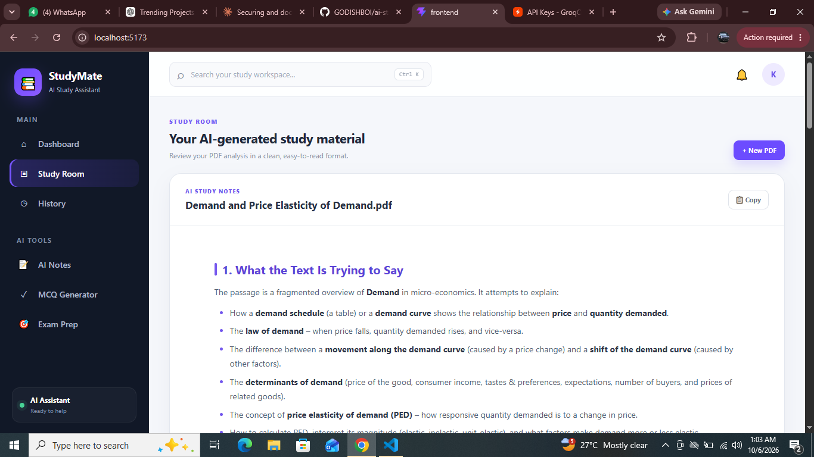

# StudyMate: AI Study Assistant



An AI-powered study assistant that helps students summarize notes, understand concepts, and generate practice questions from their study material (including PDFs).

## Features

- Upload a PDF or paste notes and get clear, structured AI study notes
- Concept explanations in plain language
- Practice question generation
- History page to revisit past sessions
- Clean dashboard with a dedicated Study Room

## Tech Stack

- **Frontend:** React + Vite
- **Backend:** Python
- **AI:** Groq API (`openai/gpt-oss-120b`)

## Getting Started

### 1. Clone the repo

```bash
git clone https://github.com/GODISHBOI/ai-study-assistant.git
cd ai-study-assistant
```

### 2. Set up the backend

```bash
cd backend
cp .env.example .env
```

Open `.env` and add your own Groq API key (get one at https://console.groq.com), then run:

```bash
pip install -r requirements.txt
python main.py
```

### 3. Set up the frontend

In a new terminal:

```bash
cd frontend
npm install
npm run dev
```

Open http://localhost:5173 in your browser.

## Environment Variables

| Variable | Description |
|---|---|
| `GROQ_API_KEY` | Your Groq API key |
| `GROQ_MODEL` | Model to use, e.g. `openai/gpt-oss-120b` |

Never commit your real `.env` file. It's already in `.gitignore`.

## Author

Built by [GODISHBOI](https://github.com/GODISHBOI)